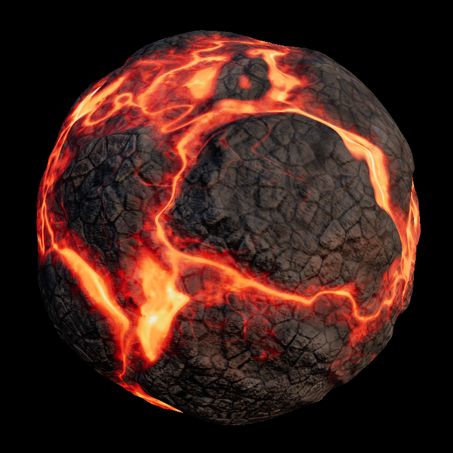

# three-tsl

Imports WGSL modules through the `@vgpu/wgsl` Vite loader and connects their
functions to a three.js `MeshPhysicalNodeMaterial` as TSL nodes, driving a
procedural lava demo.



The preview is rendered headless in Node by `pnpm previews`
(`scripts/generate-previews.ts`): `vgpu/node` creates the Dawn-backed WebGPU
device, three's `WebGPURenderer` receives that same `GPUDevice` (plus stub
canvas/context and a handful of browser-global shims), and the frame is read
back from a `RenderTarget` through the post chain — no browser involved.
The environment needs a Vulkan ICD for Dawn (see `@vgpu/adapter-node`'s
system requirements: `VK_ICD_FILENAMES`, `XDG_RUNTIME_DIR`,
`VGPU_DAWN_FLAGS=backend=vulkan`).

```
src/noise.wgsl         shared value noise / fbm / ridged noise module
src/lava.wgsl          heat, crust, sink, and blackbody fields; uses
                       @vgpu/wgsl-std voronoi3d + noise.wgsl
src/wgsl-tsl.ts        tslExports(): loader output -> callable wgslFn TSL nodes
src/lava-material.ts   physical material: emissive cracks, bump normals, and
                       vertex relief all driven by lava.wgsl
src/scenes.ts          shared scene/lights/mesh builders
src/main.ts            torus knot scene, WebGPURenderer
src/harness.ts         offscreen render smoke check (also runs headless)
scripts/generate-previews.ts  headless preview renders on vgpu/node (Dawn)
scripts/field-viz.ts          renders lava.wgsl fields to PNGs with pure vgpu
```

## Run

```bash
pnpm install
pnpm --filter @vgpu/example-three-tsl dev
```

Open the printed URL in a WebGPU-capable browser.

## The lava material

Everything procedural lives in `lava.wgsl` and flows into the material as
TSL nodes:

- `lavaGlow` — the full glow composition as `vec2f(heat, meltMask)`:
  variable-width incandescent cracks along fbm-warped voronoi plate
  boundaries (`f2 - f1` from `@vgpu/wgsl-std/noise`); melt washes flanking
  the channels, textured by `meltSkin` — a Substance-style cooling-skin
  field (anisotropic streak noise under perlin directional warps, soft like
  a blurred mask) whose filled-in bands drop the heat AND carve out of the
  liquid mask, so cooled skin shades as rock again — plus white-hot contact
  rims at wash edges and around floating crust islands; and a fringe over
  solid crust — a wide thermal gradient toward the melt plus ember speckle
  seeping through the micro grain. The skin field embosses the melt
  normals; the rock never carries these lines.
- `blackbody` — incandescence ramp (black → deep red → orange → yellow-white)
  feeding `emissiveNode` with HDR intensity under ACES tone mapping.
- `crustHeight` — plate relief plus pahoehoe rope folds on lobe patches,
  clinkery rubble elsewhere, and clustered vesicle pits; sampled once for
  shading and three more times by finite differences in TSL to build
  `normalNode` bump detail.
- `crustSurface` — one `vec4f` of shading masks (tone mottling, oxide
  staining, glassy-skin mask, vesicle pits) driving albedo, roughness
  variation, and a clearcoat "volcanic glass" sheen.
- `lavaSink` — a wide low-frequency channel mask for `positionNode` vertex
  displacement, kept separate from the thin cracks so coarse meshes don't
  stipple.

- `crustPbr` — a fourth `vec4f` of PBR masks: cavity occlusion (`aoNode`),
  iridescence patches of the glassy skin (`iridescenceNode` + IOR +
  thickness), specular-intensity mottling (`specularIntensityNode`), and
  glinting mineral facets (`metalnessNode`). The clearcoat also gets its own
  smoother `clearcoatNormalNode` — the frozen glass skin drapes over the
  plates but not the mineral grain. In total the material feeds twelve
  `MeshPhysicalNodeMaterial` slots from WGSL: color, emissive, roughness,
  metalness, ao, normal, clearcoat, clearcoat roughness, clearcoat normal,
  specular intensity, iridescence (+IOR/thickness), and position.

Lighting is image-based: a CC0 Poly Haven night HDRI (via `@pmndrs/assets`)
drives `scene.environment` and the backdrop, plus a cool moonlight key and a
faint warm floor bounce standing in for the glow lighting the crust back.
The lava scene renders through `THREE.PostProcessing` with an HDR bloom
(`three/addons/tsl/display/BloomNode.js`) thresholded above anything the
crust can reflect, so only the incandescent melt blooms.

Note on the harness: rendering straight into a `RenderTarget` skips tone
mapping and sRGB encoding (three treats targets as linear intermediates),
while the `PostProcessing` chain bakes the full output transform — so
harness screenshots match the on-screen image only on the post path
(`?post=0` reads back linear and darker).

## How the bridge works

- `import lavaModule from "./lava.wgsl"` returns `{ version: 1, wgsl }`:
  the flattened module graph, with imported helpers mangled to
  `_vgsl_<hash>__<name>` and no `export` keywords left.
- `tslExports(lavaModule, ["lavaGlow", "blackbody"])` finds each function by
  its authored name (accepting the mangle prefix), reads its parameter list
  and return type from the header, and emits a forwarding wrapper via TSL's
  `wgslFn`, attaching the whole module once as a shared `wgsl()` include.
- The returned nodes are callable with inputs keyed by WGSL parameter names.
  TSL uniforms flow in as plain function parameters — three owns the actual
  `@group/@binding` layout when it builds the shader:

```ts
const { lavaGlow, blackbody } = tslExports(lavaModule, ["lavaGlow", "blackbody"]);
const glowIntensity = uniform(2.4);
material.emissiveNode = blackbody({ t: lavaGlow({ position: positionLocal, t: time }).x }).mul(glowIntensity);
```

Entry points and functions that touch `@group/@binding` resources do not map
to `wgslFn` — TSL manages bindings itself. Pure functions (like everything in
`@vgpu/wgsl-std`) are the sweet spot.

## Tests

`pnpm --filter @vgpu/example-three-tsl test` covers the header parser and
wrapper generation, and resolves `src/lava.wgsl` through
`@vgpu/wgsl/runtime` to check the bridge against real loader output.

`/harness.html` (dev server) renders the material into a `RenderTarget` with a
stubbed canvas context and reports lit/distinct pixel counts on
`window.__result` — usable from headless chromium where WebGPU canvas
presentation is unavailable (`--enable-unsafe-webgpu --enable-features=Vulkan
--use-vulkan=swiftshader --in-process-gpu`).
